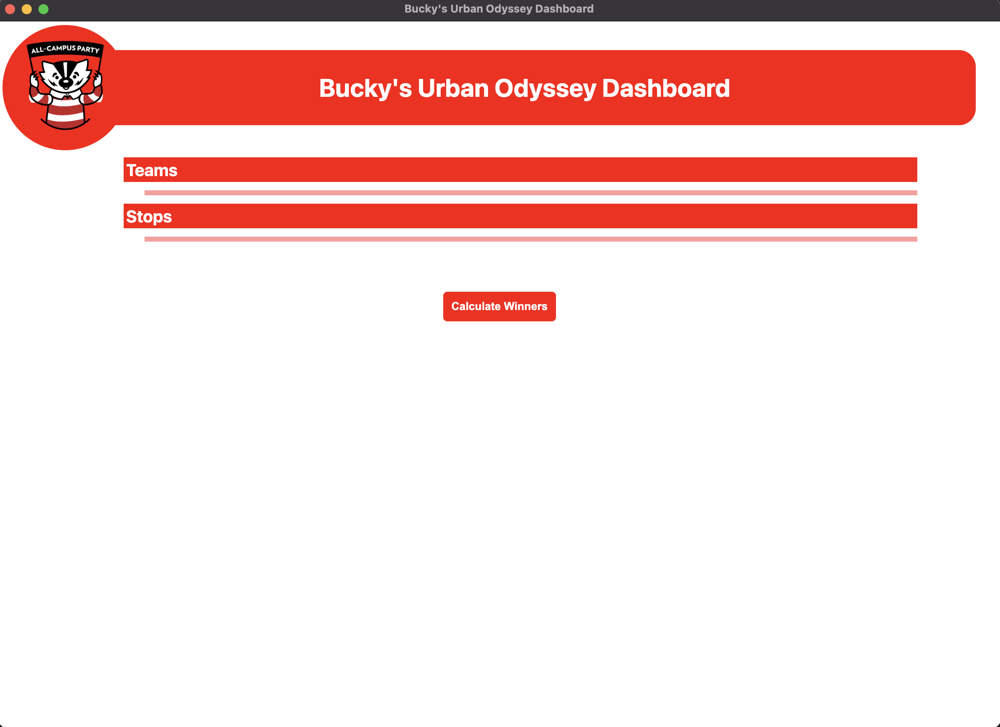
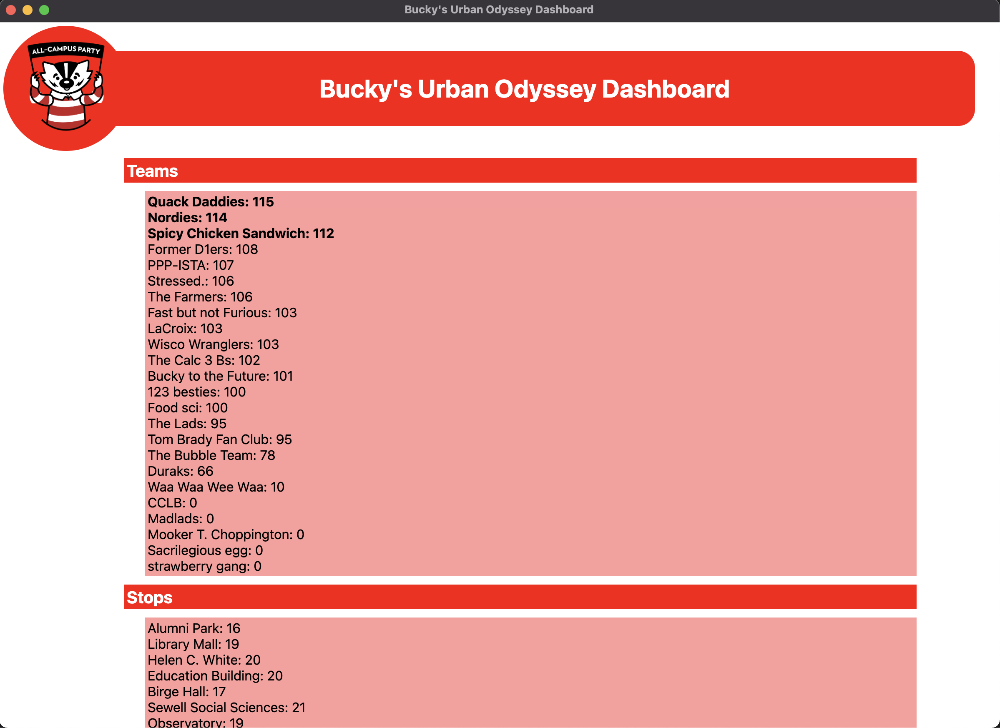
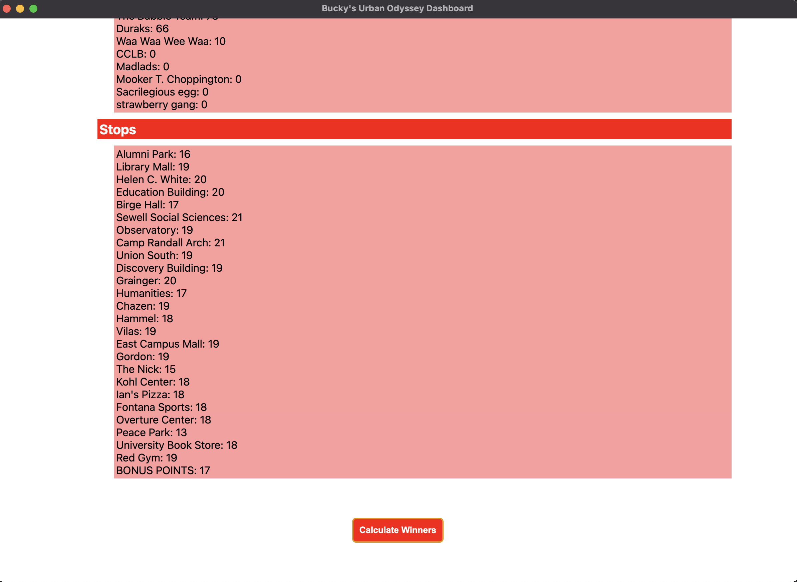

# Bucky's Urban Odyssey Dashboard

## Description

This application was built for a University of Wisconsin event called Bucky's Urban Odyssey. The event itself is a full day scavenger hunt where participants run from stop to stop completing various challenges to be awarded points.

This dashboard takes in score and stop data for each team from a google sheet, using the google sheets API, which is linked to a scoring google form.

Once the application has obtained the data, it tallies each teams' score as well as the number of visits each stop had, ranks these lists in decsending order and outputs these lists to the dashboard.

The application also outputs the data back to the form on different tabs so that it is saved after closing the application.

## Usage

### Set Up

1.  This application **requires** that the stop name is in the second column of the form, the team name is in the third column, and the score is in the fourth column.

2.  The google sheet id must be stored in a env file named SHEET_ID

3.  There must be a file named keys.json in the data folder (this json will be provided by google when you sign up for a develper account)

4.  Finally, you must share the google sheet with your developer account(which must have permission to read/write to the spreadsheet)

### Using the application

##### This is the dashboard when it is first opened.

##### This is the upper part of the dashboard after pressing "Calculate Winners" (must have an env file storing the google sheet id (SHEET_ID) that you are accessing).

## Why Electron?

As a web developer, I feel confident working with the react framework -- _So why not use react?_

I wanted the app to be easily packagable, without the need for it to be hosted on a website. I decided that it would be easier to use electron, build it, and then be able to simply run the executable on any mac at the event.

I also had never used electron prior to this and am always excited to experiment with new technologies (or new to me technologies).

## Features to add

- Rather than storing the google sheet id, the application should be able to take a url in as input, parse it, and obtain the sheet id that way.

- The application could be much more visually appealing, I would like to revamp the whole look of the application.

## Next Steps

Transitioning the whole application to a webapp, created with React, hosted on github.

- The focus will then be placed on creating a closed system where stops will use a form hosted on the webapp to submit a given team's score.

**_But, Why?_**

Doing this will enable the application to be used many years into the future without someone needing to update google API permissions, sharing google sheets with developer accounts, or updating developer keys in the code.

**In short, for accessibility.**
